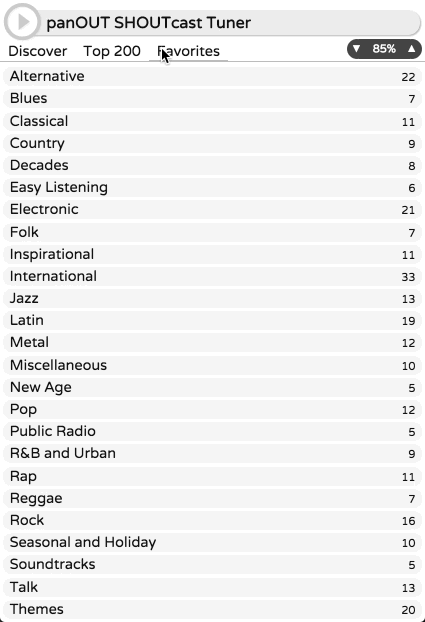
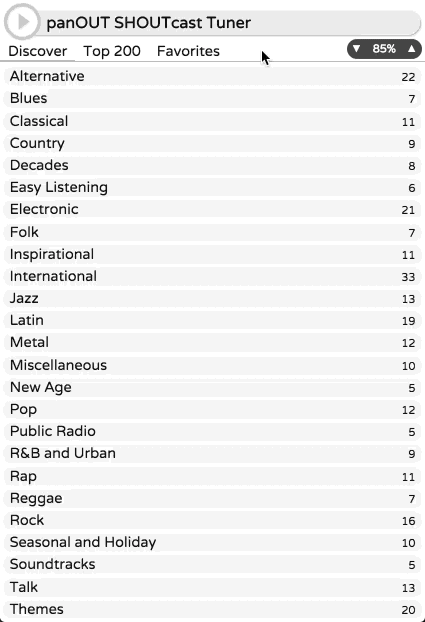
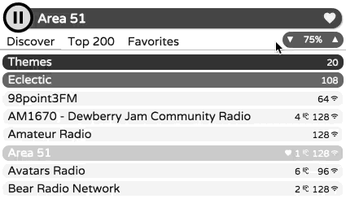
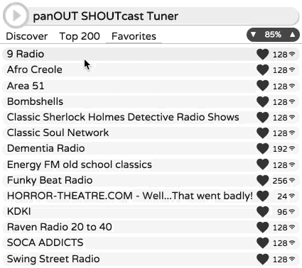

# panOUT
## SHOUTcast Radio Tuner
### Purpose

**panOUT** is the result of a longstanding interest in underground, DIY, and narrowcast audio: the long, narrow tail of electronic transmissions. Back in the 20th century we had shortwave, ham, and pirate radio rigs. In the 21st, we've got internet radio streams.

[SHOUTcast](http://www.shoutcast.com/) was one of the first free streaming tools, and spawned thousands of stations around the globe. Unfortunately, those stations can be difficult to discover. There's a genre-based index and API, but its capabilities are fairly limited. Meanwhile, the client-side receivers tend to be Web-based and awkward to use. panOUT is an effort to ease SHOUTcast station exploration.

### Features

- **Desktop-based** ➜  independently available and controllable, outside of a browser tab
- **Cross-platform** ➜  thanks to its [Electron](http://electron.atom.io/) foundation, builds to Mac OS X, Windows, and Linux
- **Compact design** ➜  utilizing an adaptive variation of accordion navigation
- **Single-click favorites** ➜ hang on to 'em once you've found 'em
- **Bandwidth friendly** ➜ lists loaded on demand, then cached for remainder of session

### How to Build

Until binaries becomes available, here's what you'll need ...

- [Electron](http://electron.atom.io/) ➜ for the cross-platform framework ...
- [Vue](https://www.npmjs.com/package/vue) ➜ for data binding and conditional rendering ...

### Demos

#### Navigation

#### Browse/Discover

#### Volume Control

#### Favorites
